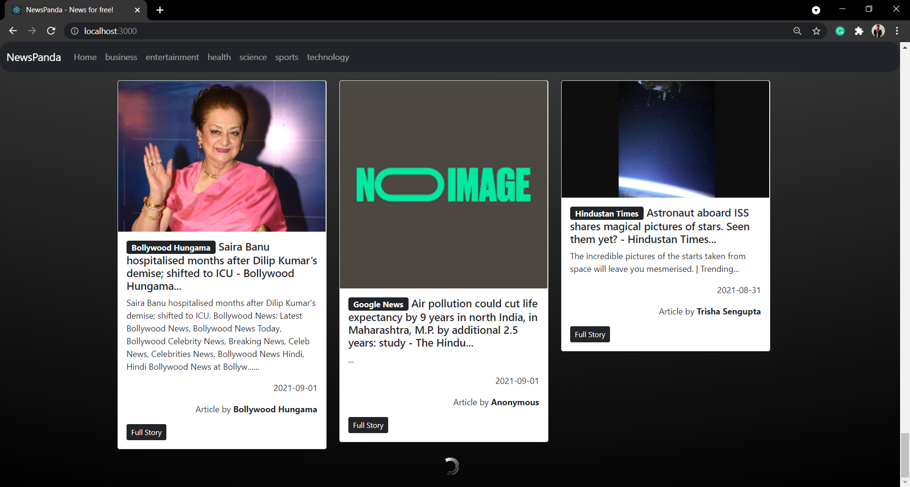
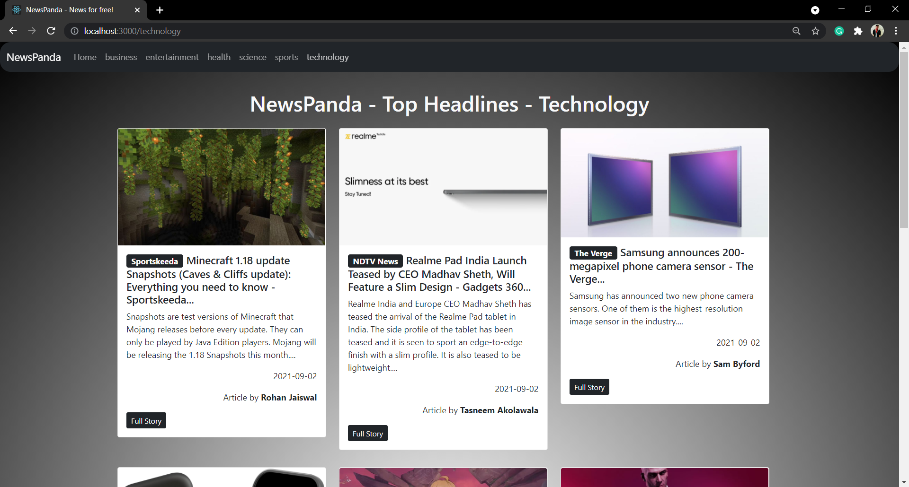
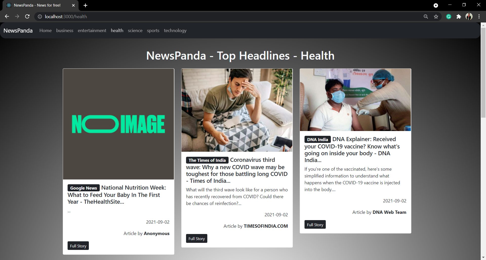
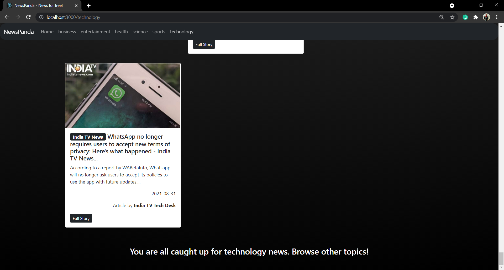

# ReadMe

NewsPanda is a react app that fetches latest news using the newsapi.org api. The app is made by implementing react class components.

### Screenshots of the app running on localhost:

Spinner when more content is being loaded:

Category-wise news browsing:

Footer message when there is no more news for that category:

